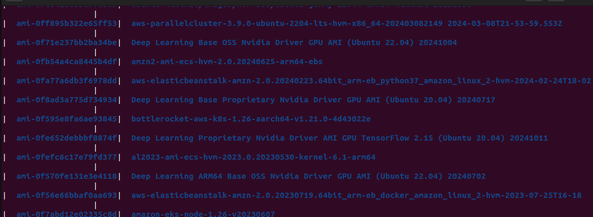

# configuring_aws_and_launching_ec2_instance

1. **Installing aws cli:**
   ```bash
    sudo apt install awscli
    


2. **verifying the installation:**
   ```bash
    aws --version
    


3. **configuring the aws cli:**
   ```bash
    aws configure
    


4. **creating a named profile:**
   ```bash
    aws configure --profile myprofile
    


5. **finding available Amazon Machine Image (AMI):**
   ```bash
    aws ec2 describe-images --owners amazon --query "Images[*].[ImageId,Name]" --output table
    


6. **creating a key pair:**
   ```bash
    aws ec2 create-key-pair --key-name dev --query "KeyMaterial" --output text --profile myprofile > dev.pem


7. **launching an ec2 instance:**
   ```bash
    aws ec2 run-instances --image-id ami-0866a3c8686eaeeba --count 1 --instance-type t2.micro --key-name dev --profile myprofile

    


8. **verifying that the instance is running:**
   ```bash 
    aws ec2 describe-instances --profile myprofile --query "Reservations[*].Instances[*].[InstanceId,State.Name]" --output table
    


9. **obtaining the public address of the instance:**
   ```bash 
    aws ec2 describe-instances --profile myprofile --query "Reservations[*].Instances[*].[PublicIpAddress]" --output table
    


1. **ssh into the instance:**
   ```bash 
    ssh -i dev.pem ubuntu@ec2-44-203-156-189.compute-1.amazonaws.com
    


2. **terminating the instance:**
   ```bash 
    aws ec2 terminate-instances --instance-ids i-05d391dff39e320a8 --profile myprofile
    


3. **verifying that the instance is terminated to avoid charges:**
   ```bash 
    aws ec2 describe-instances --profile myprofile --query "Reservations[*].Instances[*].[InstanceId,State.Name]" --output table
    

